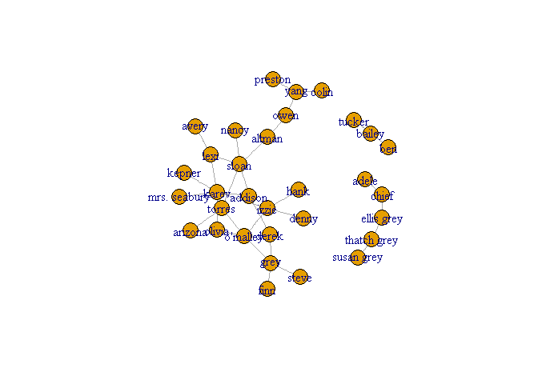
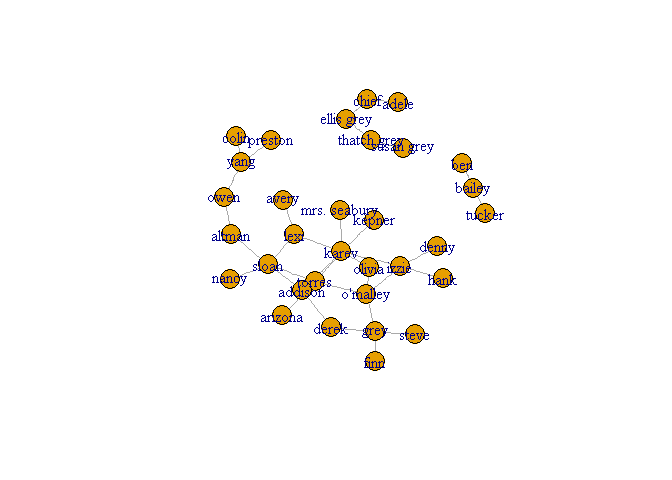
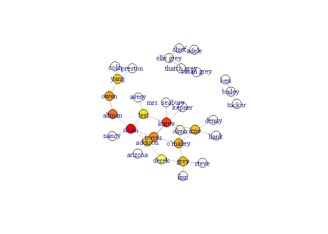
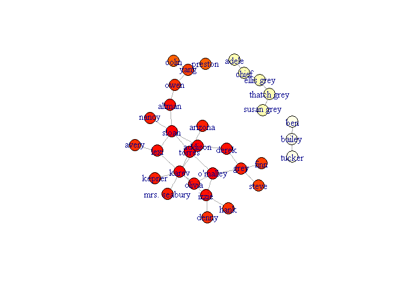
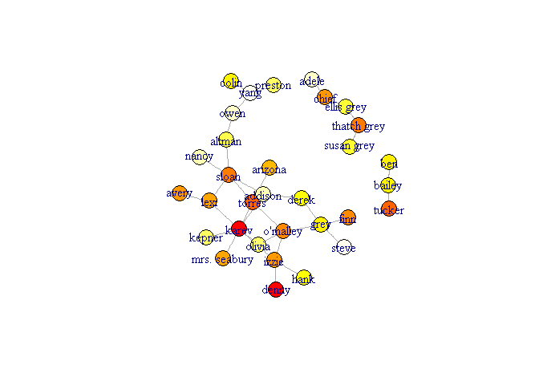
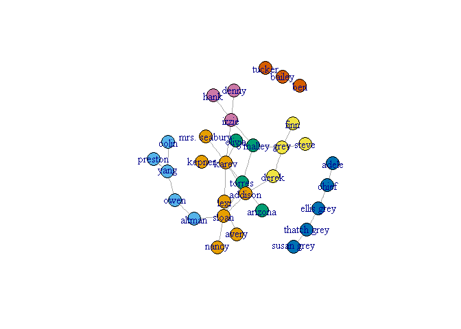
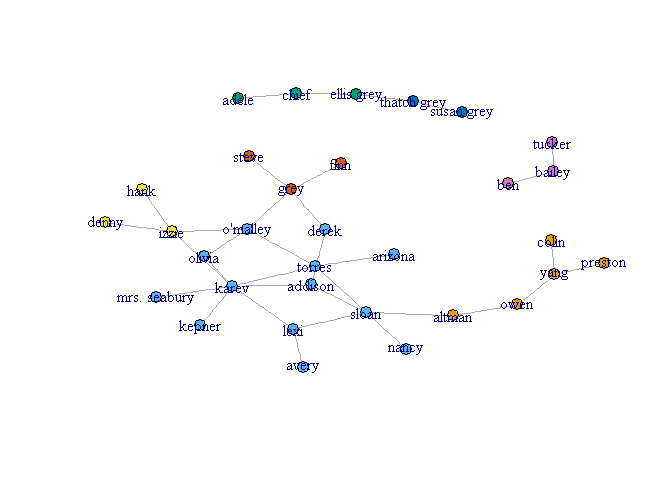

# Data Science Course - assignment 3- network analysis

#### Tom Leibovich and Manor Lahagani


``` r
#Q1.a
#### install and load igraph package
##install.packages("igraph")
library(igraph)
```

    ## Warning: package 'igraph' was built under R version 3.2.5

    ## 
    ## Attaching package: 'igraph'

    ## The following objects are masked from 'package:stats':
    ## 
    ##     decompose, spectrum

    ## The following object is masked from 'package:base':
    ## 
    ##     union

``` r
#### read graph
ga.data= read.csv('http://www.babelgraph.org/data/ga_edgelist.csv', header=TRUE)

g=graph.data.frame(ga.data,directed=FALSE)

summary(g)
```

    ## IGRAPH UN-- 32 34 -- 
    ## + attr: name (v/c)

``` r
####the graph:
plot(g)
```



``` r
g$layout<-layout.fruchterman.reingold(g)
plot(g)
```



``` r
#betweenness- the max is "sloan"
t=g

btw=betweenness(t)
btw.score=round(btw)+1
btw.colors=rev(heat.colors(max(btw.score)))
V(t)$color=btw.colors[btw.score]
plot(t)
```



``` r
maxb=which(max(betweenness(t, v=V(t),directed=FALSE, weights=NULL,nobigint=FALSE,normalized=FALSE))==betweenness(t, v=V(t),directed=FALSE, weights=NULL,nobigint=FALSE,normalized=FALSE))
V(t)[maxb]$name
```

    ## [1] "sloan"

``` r
#Closeness- the max is "torress"
t=g
cl=closeness(t)
cl.score=round((cl-min(cl))* length(cl)/max(cl))+1
cl.colors=rev(heat.colors(max(cl.score)))
V(t)$color=cl.colors[cl.score]
## configure because of figure margins too large error
plot(t)
```



``` r
maxCloseness = which((closeness(t))==max(closeness(t)))
V(t)[maxCloseness]$name
```

    ## [1] "torres"

``` r
#Eigencetor - the max is "karev"
t=g
ei=evcent(t)
ei$vector=ei$vector*100
ei$colors=rev(heat.colors(max(ei$vector)))
V(t)$color=ei$colors[ei$vector]
```

    ## Warning in vattrs[[name]][index] <- value: number of items to replace is
    ## not a multiple of replacement length

``` r
plot(t)
```



``` r
maxEi=which(max(evcent(t)$vector)==(evcent(t)$vector))
V(t)[maxEi]$name
```

    ## [1] "karev"

``` r
#Q1.b - Finding Communities

##Grivan-Newman algorithm
### The Girvan–Newman algorithm detects communities by progressively removing edges from the original network 

t=g

####remove multi edges and loops
t=simplify(t)
####calc edge betweenness
ebc = edge.betweenness.community(t, directed=F)

####calc modularity
mods = sapply(0:ecount(t), function(i){
  t2 = delete.edges(t, ebc$removed.edges[seq(length=i)])
  cl = clusters(t2)$membership
  modularity(t,cl)
})
#coloring the nodes according to their membership
t2<-delete.edges(t, ebc$removed.edges[seq(length=which.max(mods)-1)])
V(t)$color=clusters(t2)$membership

t$layout <- layout.fruchterman.reingold
plot(t)
```



``` r
###We got 7 communities . each color represent the community.
###the comunity sizes:
sizes(ebc)
```

    ## Community sizes
    ## 1 2 3 4 5 6 7 
    ## 8 5 4 4 5 3 3

``` r
####Community sizes
####1 2 3 4 5 6 7 
####8 5 4 4 5 3 3 
### The modularity:0.5774221 
modularity(ebc)
```

    ## [1] 0.5774221

``` r
#Walk Trap algorithm
###The idea is that short random walks tend to stay in the same community.
###We got 7 communities. each  color represent the community
t=g

wtc = walktrap.community(t)
memb = cutat(wtc, steps= which.max(wtc$modularity)-1)
plot(t, layout=layout.fruchterman.reingold, vertex.size=5,vertex.color=memb, asp=FALSE)
```



``` r
###the comunity sizes:
sizes(wtc)
```

    ## Community sizes
    ##  1  2  3  4  5  6  7 
    ##  5 13  3  3  2  3  3

``` r
###Community sizes
### 1  2  3  4  5  6  7 
### 5 13  3  3  2  3  3 
### The modularity:0.5147059 
modularity(wtc)
```

    ## [1] 0.5147059
