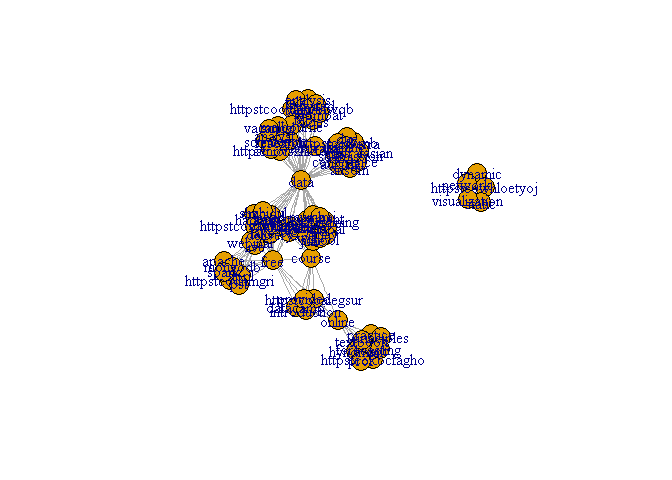
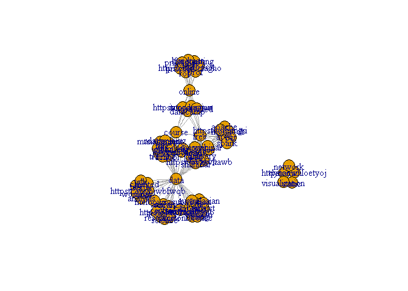
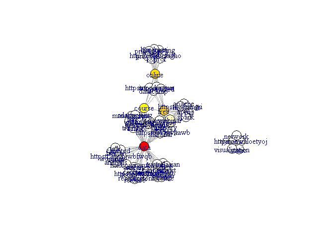
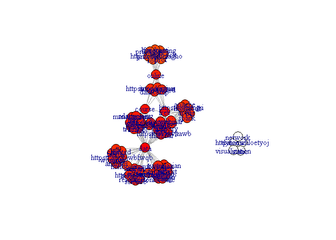
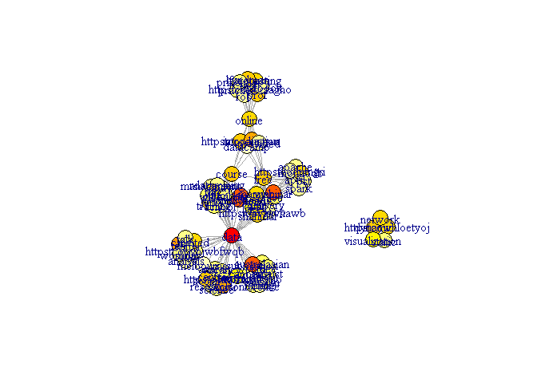
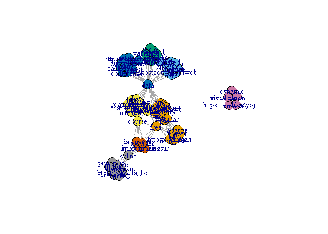
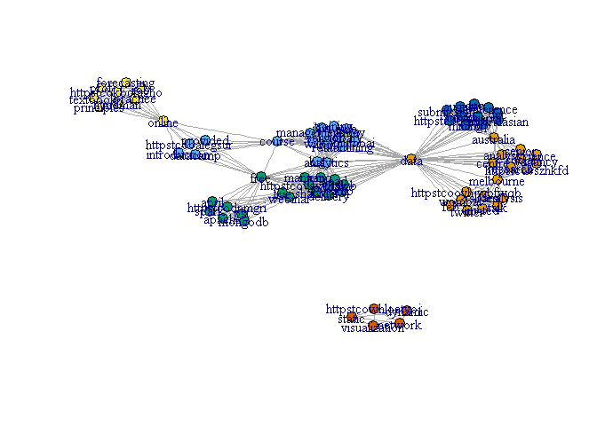

# Data Science course - Assignment 3 - part 2
## Text-Text network analysis through data mining on the "rdatamining" twitter account.
### We analyze connections between the word data in a few tweets from the r-data-mining account.

``` r
library(twitteR)
library(ROAuth)
library(plyr)
library(stringr)
library(ggplot2)
library(tm)
library(SnowballC)
library(RWeka)
library(rJava)
library(RWekajars)
library(igraph)
download.file(url = "http://curl.haxx.se/ca/cacert.pem", destfile="cacert.pem")
```
#### loading key file instead of having secret key in the code.
#### first line is consumer key. second is secret key. 3rd is access token. 4th is access secret.
```{r}
keys = readLines("c:\\dev\\work\\r\\3\\keys.txt")
setup_twitter_oauth(keys[1], keys[2], keys[3], keys[4])
```

    ## [1] "Using direct authentication"

``` r
#### get a thousand tweets from the timeline
rawTweets <- userTimeline("rdatamining", n=10)

#### create a dataframe in order to later create a corpus.
df = do.call("rbind",lapply(rawTweets,as.data.frame))

#### build a corpus
myCorpus = Corpus(VectorSource(df$text))

#### the corpus needs some transformation in order to analyze it correctly.
#### transformations: 1.lower case 2. remove punctuation 3. remove numbers 4. removing non-intesting words.

#myCorpus = tm_map(myCorpus,tolower)

myCorpus <- tm_map(myCorpus, content_transformer(tolower))
myCorpus <- tm_map(myCorpus, content_transformer(removePunctuation))
myCorpus <- tm_map(myCorpus, content_transformer(removeNumbers))
for (i in 1:length(myCorpus)) {
  myCorpus[[i]] <- removeWords(myCorpus[[i]], stopwords("english"))
}

tdm <- TermDocumentMatrix(myCorpus, control = list(minWordLength = 1))
tdm <- as.matrix(tdm)
# change it to a Boolean matrix
tdm[tdm>=1] <- 1
#transform into a term-term adjacency matrix
termMatrix <- tdm %*% t(tdm)

g <- graph.adjacency(termMatrix, weighted=T, mode = "undirected")
# remove loops
g <- simplify(g)

summary(g)
```

    ## IGRAPH UNW- 80 483 -- 
    ## + attr: name (v/c), weight (e/n)

``` r
####the graph:
plot(g)
```

<!-- -->

``` r
g$layout<-layout.fruchterman.reingold(g)
plot(g)
```

<!-- -->

``` r
#betweenness- the max is "sloan"
t=g

btw=betweenness(t)
btw.score=round(btw)+1
btw.colors=rev(heat.colors(max(btw.score)))
V(t)$color=btw.colors[btw.score]
plot(t)
```

<!-- -->

``` r
maxb=which(max(betweenness(t, v=V(t),directed=FALSE, weights=NULL,nobigint=FALSE,normalized=FALSE))==betweenness(t, v=V(t),directed=FALSE, weights=NULL,nobigint=FALSE,normalized=FALSE))
V(t)[maxb]$name
```

    ## [1] "data"

``` r
#Closeness- the max is "torress"
t=g
cl=closeness(t)
cl.score=round((cl-min(cl))* length(cl)/max(cl))+1
cl.colors=rev(heat.colors(max(cl.score)))
V(t)$color=cl.colors[cl.score]
## configure because of figure margins too large error
plot(t)
```

<!-- -->

``` r
maxCloseness = which((closeness(t))==max(closeness(t)))
V(t)[maxCloseness]$name
```

    ## [1] "data"

``` r
#Eigencetor - the max is "karev"
t=g
ei=evcent(t)
ei$vector=ei$vector*100
ei$colors=rev(heat.colors(max(ei$vector)))
V(t)$color=ei$colors[ei$vector]
```

    ## Warning in vattrs[[name]][index] <- value: number of items to replace is
    ## not a multiple of replacement length

``` r
plot(t)
```

<!-- -->

``` r
maxEi=which(max(evcent(t)$vector)==(evcent(t)$vector))
V(t)[maxEi]$name
```

    ## [1] "data"

``` r
##Grivan-Newman algorithm
### The Girvan–Newman algorithm detects communities by progressively removing edges from the original network 

t=g

####remove multi edges and loops
t=simplify(t)
####calc edge betweenness
ebc = edge.betweenness.community(t, directed=F)

####calc modularity
mods = sapply(0:ecount(t), function(i){
  t2 = delete.edges(t, ebc$removed.edges[seq(length=i)])
  cl = clusters(t2)$membership
  modularity(t,cl)
})
#coloring the nodes according to their membership
t2<-delete.edges(t, ebc$removed.edges[seq(length=which.max(mods)-1)])
V(t)$color=clusters(t2)$membership

t$layout <- layout.fruchterman.reingold
plot(t)
```

<!-- -->

``` r
###the comunity sizes:
sizes(ebc)
```

    ## Community sizes
    ##  1  2  3  4  5  6  7  8 
    ## 18  9  8 14 13  4  5  9

``` r
### modulraity:
modularity(ebc)
```

    ## [1] 0.605056

``` r
#Walk Trap algorithm
###The idea is that short random walks tend to stay in the same community.
###We got 7 communities. each  color represent the community
t=g

wtc = walktrap.community(t)
memb = cutat(wtc, steps= which.max(wtc$modularity)-1)
plot(t, layout=layout.fruchterman.reingold, vertex.size=5,vertex.color=memb, asp=FALSE)
```

<!-- -->

``` r
###the comunity sizes:
sizes(wtc)
```

    ## Community sizes
    ##  1  2  3  4  5  6 
    ## 19 18 18  9 11  5

``` r
### The modularity:
modularity(wtc)
```

    ## [1] 0.6065803
